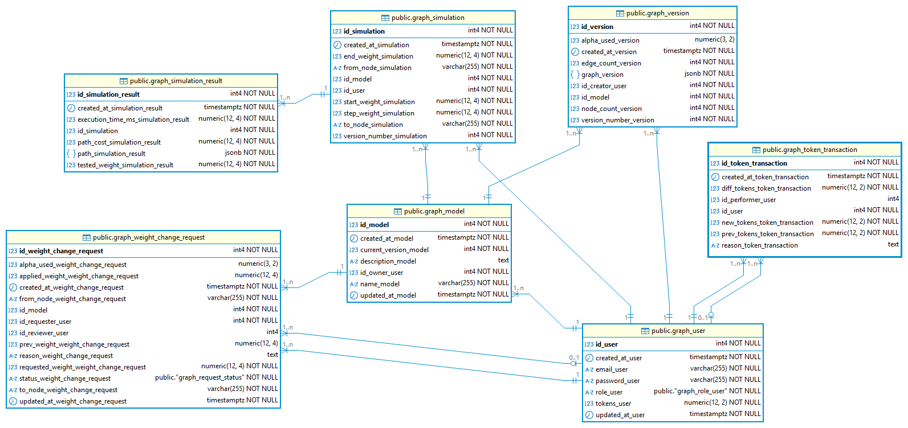

# Database & Models Documentation

## Database Structure
Entity / Relationship Diagram

<div style="text-align:center">
  
</div>

---

### Main Tables

#### 1. User (`graph_user`)
- **id_user**: Integer (PK)
- **email_user**: String, unique, required
- **password_user**: String, required (stored encrypted)
- **role_user**: Enum (`user`, `admin`), required
- **tokens_user**: Numeric, initialized via seed
- **created_at_user**: Timestamp, auto-populated
- **updated_at_user**: Timestamp, auto-populated

---

#### 2. Model (`graph_model`)
- **id_model**: Integer (PK)
- **id_owner_user**: Integer (FK → `graph_user`)
- **name_model**: String, required
- **description_model**: Text, optional
- **current_version_model**: Integer (FK → `graph_version`)
- **created_at_model**: Timestamp, auto-populated
- **updated_at_model**: Timestamp, auto-populated

---

#### 3. Version (`graph_version`)
- **id_version**: Integer (PK)
- **id_model**: Integer (FK → `graph_model`)
- **id_creator_user**: Integer (FK → `graph_user`)
- **version_number_version**: Integer
- **graph_version**: JSONB (nodes, edges, weights)
- **node_count_version**: Integer
- **edge_count_version**: Integer
- **alpha_used_version**: Numeric(3,2)
- **created_at_version**: Timestamp, auto-populated

---

#### 4. Simulation (`graph_simulation`)
- **id_simulation**: Integer (PK)
- **id_model**: Integer (FK → `graph_model`)
- **id_user**: Integer (FK → `graph_user`)
- **version_number_simulation**: Integer
- **from_node_simulation**: String
- **to_node_simulation**: String
- **start_weight_simulation**: Numeric(12,4)
- **end_weight_simulation**: Numeric(12,4)
- **step_weight_simulation**: Numeric(12,4)
- **created_at_simulation**: Timestamp, auto-populated

---

#### 5. Simulation Result (`graph_simulation_result`)
- **id_simulation_result**: Integer (PK)
- **id_simulation**: Integer (FK → `graph_simulation`)
- **execution_time_ms_simulation_result**: Numeric(12,4)
- **path_cost_simulation_result**: Numeric(12,4)
- **path_simulation**: JSONB
- **tested_weight_simulation_result**: Numeric(12,4)
- **created_at_simulation_result**: Timestamp, auto-populated

---

#### 6. Weight Change Request (`graph_weight_change_request`)
- **id_weight_change_request**: Integer (PK)
- **id_model**: Integer (FK → `graph_model`)
- **id_requester_user**: Integer (FK → `graph_user`)
- **id_reviewer_user**: Integer (FK → `graph_user`)
- **from_node_weight_change_request**: String
- **to_node_weight_change_request**: String
- **prev_weight_weight_change_request**: Numeric(12,4)
- **requested_weight_weight_change_request**: Numeric(12,4)
- **applied_weight_weight_change_request**: Numeric(12,4)
- **alpha_used_weight_change_request**: Numeric(3,2)
- **status_weight_change_request**: Enum (`pending`, `approved`, `rejected`)
- **reason_weight_change_request**: Text
- **created_at_weight_change_request**: Timestamp, auto-populated
- **updated_at_weight_change_request**: Timestamp, auto-populated

---

#### 7. Token Transaction (`graph_token_transaction`)
- **id_token_transaction**: Integer (PK)
- **id_user**: Integer (FK → `graph_user`)
- **id_performer_user**: Integer (FK → `graph_user`)
- **prev_tokens_token_transaction**: Numeric(12,2)
- **new_tokens_token_transaction**: Numeric(12,2)
- **diff_tokens_token_transaction**: Numeric(12,2)
- **reason_token_transaction**: Text
- **created_at_token_transaction**: Timestamp, auto-populated

---

## Relationships

### One-to-Many
- **User → Model**: A user can own multiple models.
- **User → TokenTransaction**: A user can have multiple token transactions.
- **Model → Version**: A model can have multiple versions.
- **Model → Simulation**: A model can have multiple simulations.
- **Model → WeightChangeRequest**: A model can have multiple weight change requests.
- **Simulation → SimulationResult**: A simulation can generate multiple results.

### One-to-One
- **Model → CurrentVersion**: Each model references its current version.
- **WeightChangeRequest → Reviewer**: Each request can be reviewed once by the model owner.

---

## Test Data

The seeders include:

- **Users**:    
    - 1 admin with **999 tokens** (`admin@test.com`, password: `admin123`)
    - N regular users with **100 tokens** each (default from `.env`: `INIT_USER_TOKENS=100`)

- **Models**:
    - At least 2 models per user
    - Each model has minimum **10 nodes** and **15 edges**

- **Versions**:
    - Each model has at least **2 versions**
    - Different complexity (nodes/edges)

- **Simulations**:
    - One simulation per version with random `from_node` and `to_node`

- **Weight Change Requests**:
    - Pending, approved, and rejected requests seeded
    - Random weights and alpha values

- **Token Transactions**:
    - `creation_user_recharge` → Initial token assignment when user is created
    - `admin_recharge` → Admin can manually recharge tokens for users
    - `model_creation_recharge` → Cost deduction when creating a model
    - Execution of models also deducts tokens based on creation cost

---

## System Costs

According to project requirements:

- **Model Creation**:
    - `0.20` tokens per node
    - `0.01` tokens per edge

- **Model Execution**:
    - Same cost as creation (tokens deducted per execution)

- **Weight Change Update (approved)**:
    - Applied using exponential moving average formula:
      ```
      p(i,j) = α * p(i,j) + (1 - α) * p_new(i,j)
      ```
    - With **α = 0.9** (default if misconfigured)

The system always checks **available tokens** before creating or executing models.

---

## Implementation Notes

- Primary keys are **auto-increment integers**.
- Graphs are stored as **JSONB** in `graph_version`.
- Alpha (`α`) for weight updates is loaded from **environment variable**:
    - Must satisfy `0 < α < 1`
    - Defaults to `0.9` if misconfigured.
- **JWT** authentication is required for every request.
- All relationships managed with **foreign keys and CASCADE**.
- Automatic management of timestamps (`created_at`, `updated_at`).

---

## Database Connection

Database connection is managed through a **Sequelize singleton instance**.  
Connection parameters are loaded from **`.env`** configuration.

---

## Workflow to Interact with DB Objects

**Controller → Service → Repository → DAO → Database**

This design pattern ensures separation of concerns and maintainability.

