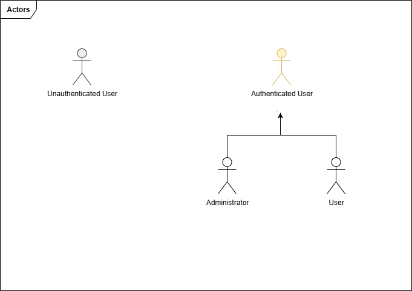
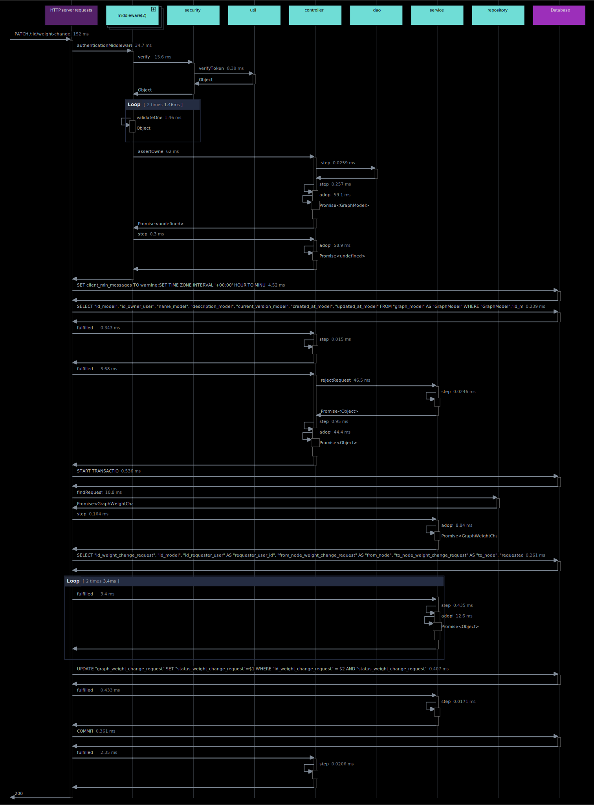
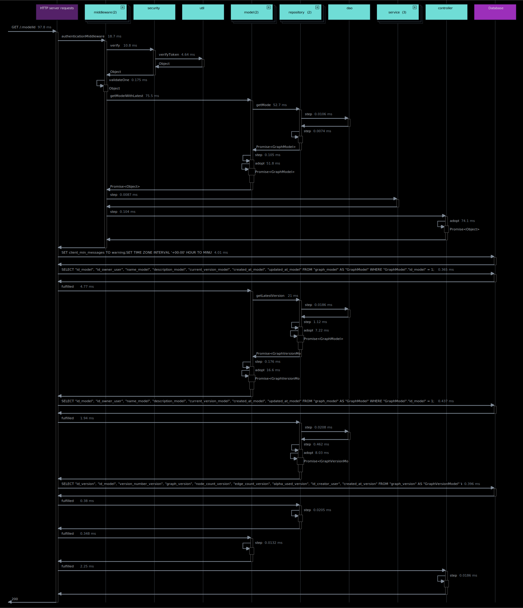

# Graph Optimization Backend


[](https://www.docker.com/)
[](https://docs.docker.com/compose/)
[](https://eslint.org/)
[](https://expressjs.com/)
[](https://github.com/)
[](https://developer.mozilla.org/en-US/docs/Web/JavaScript)
[](https://jestjs.io/)
[](https://jwt.io/)
[](https://www.json.org/)
[](https://nodejs.org/)
[](https://www.npmjs.com/)
[](https://www.postgresql.org/)
[](https://www.postman.com/)
[](https://prettier.io/)
[](https://sequelize.org/)
[](https://swagger.io/)
[](https://www.typescriptlang.org/)


## Introduction
This backend system is designed to manage the **creation, execution, and evaluation of graph optimization models**.  
It supports authenticated user contributions for updating edge weights, simulating a **crowd-sourcing model** where users collaboratively refine optimization data.  

The system uses **Dijkstra’s shortest path algorithm** for graph optimization.  
All API endpoints are **secured with JWT authentication**.  


## Project Objective
- Enable users to **create graph optimization models** with node and edge weights.  
- Execute shortest path queries between nodes and return results with cost and execution time.  
- Provide a mechanism for **weight change requests**, which require model owner approval/rejection.  
- Support **version tracking** of graph models and their weights.  
- Allow **simulation of weight variations** to study the impact of incremental changes.  
- Implement a **token-based economy**, where each action consumes credits, managed via JWT-authenticated users.  
- Include **Admin functionality** to recharge tokens.  


## Features

- **User Authentication & Authorization**
  - JWT-based authentication with RS256 algorithm  
  - Role-based access control (**User/Admin**)  
  - Secure password hashing with bcrypt  

- **Graph Model Management**
  - Create, retrieve, update, and delete graph models  
  - Token-based cost system:  
    - `0.20` per node  
    - `0.01` per edge  
  - Execution of shortest path queries using **Dijkstra**  
  - Automatic execution time tracking  

- **Weight Change Requests**
  - Submit edge weight updates (state: **Pending, Approved, Rejected**)  
  - Approval by model owner with **exponential smoothing**:  
    ```
    p(i,j) = α * p(i,j) + (1 - α) * p_new(i,j)
    ```
  - Configurable `α` in `.env` (default: 0.9)  

- **Model Versions**
  - Multiple versions tracked per model  
  - Filtering by modification date, node count, or edge count  

- **Simulations**
  - Simulate weight changes across a range with incremental steps  
  - Return full set of results + best configuration  
  - Validate inputs and ranges  

- **Token Management**
  - Users start with initial tokens (`INIT_USER_TOKENS`, default 100)  
  - Token costs apply to creation and execution  
  - Unauthorized requests when balance is insufficient  
  - **Admin-only token recharge route**  

- **Database & Persistence**
  - PostgreSQL with Sequelize ORM  
  - Transaction logging (`graph_token_transactions`)  
  - Seeder scripts with:  
    - At least 2 graph models  
    - Minimum 10 nodes & 15 edges each  
    - Multiple versions preloaded  

- **API Documentation**
  - Swagger/OpenAPI specification (Interactive API documentation)    
    - http://localhost:3000/api/docs/
  - Postman-ready endpoints  


## Technology Stack

- **Backend**: 
  - **Node.js** + **Express** – API framework
  - **TypeScript** – Type safety and maintainability
- **Database**: 
  - **Sequelize** – ORM for PostgreSQL
  - **PostgreSQL** – Relational database
- **Authentication**: 
  - **JWT (RS256)** – Authentication & authorization
- **Containerization**: 
  - Docker, Docker Compose
- **Documentation**: 
  - Swagger/OpenAPI
- **Testing**: 
  - Jest


## Installation

### Prerequisites (Production)
- **Docker Engine** (to run containers)
- **PostgreSQL Client** (to execute SQL scripts if needed, e.g., `graphDDL.sql`.`seeders.sql`)

### Local Setup (Development)
```bash
npm install
npm run build
npm run start
````

### Environment Setup

Copy `.env.example` into `.env` and configure values:

```env
## Content of .env.example
NODE_ENV=development
API_PORT=3001
APP_TZ=Europe/Rome

# PostgreSQL
POSTGRES_USER=postgres
POSTGRES_PASSWORD=postgres
POSTGRES_DB=graphdb
#dev:localhost / prod:postgres
POSTGRES_HOST=localhost
POSTGRES_PORT=5432
PGSSL=false

# JWT
JWT_PRIVATE_KEY_PATH=./keys/private.key
JWT_PUBLIC_KEY_PATH=./keys/public.key
JWT_EXPIRES_IN=3600
JWT_ALGORITHM=RS256
JWT_SALT_ROUNDS=12
INIT_USER_TOKENS=100
JWT_ISSUER=backend-graphs
JWT_AUDIENCE=api-clients

# Logging / Graph
DB_LOGGING=false
GRAPH_ALPHA=0.9

# Admin user (prod)
ADMIN_EMAIL=admin@test.com
ADMIN_PASSWORD=supersecurepassword
ADMIN_TOKENS=999

```

## Docker Setup

### First Launch or Rebuild

```bash
docker compose up --build
# or for detached mode
docker compose up --build -d
```

### Subsequent Launches

```bash
docker compose up
# or for detached mode
docker compose up -d
```

## Development Setup

The Docker configuration mounts `src` and `tsconfig.json` as volumes, so changes to these files are automatically synced to the container. Changes to other files require a rebuild.


## API Documentation

Complete API documentation is available at `/api/docs` when the server is running. It provides an interactive interface to explore all endpoints, request/response formats, and authentication requirements.

### Authentication

| Method | Endpoint              | Description                |
| ------ | --------------------- | -------------------------- |
| POST   | `/api/auth/register`  | Register a new user        |
| POST   | `/api/auth/login`     | Login user                 |
| GET    | `/api/users/me`       | Get user profile           |
| POST   | `/api/users/recharge` | Admin recharge user tokens |

### Graph Models

| Method | Endpoint                  | Description         |
| ------ | ------------------------- | ------------------- |
| POST   | `/api/models`             | Create new model    |
| POST   | `/api/models/:id/execute` | Execute model query |
| GET    | `/api/models/:id`         | Get model details   |

### Weight Change Requests

| Method | Endpoint                                                          | Description                   |
| ------ | ----------------------------------------------------------------- | ----------------------------- |
| POST   | `/api/models/:id/weight-change`                                   | Submit weight change request  |
| GET    | `/api/models/:id/weight-change?state=pending&fromDate=YYYY-MM-DD` | Filter requests by state/date |
| PATCH  | `/api/models/:id/weight-change/:requestId/approve`                | Approve request               |
| PATCH  | `/api/models/:id/weight-change/:requestId/reject`                 | Reject request                |

### Model Versions

| Method | Endpoint                                             | Description           |
| ------ | ---------------------------------------------------- | --------------------- |
| GET    | `/api/models/:id/versions?nodeCount=12&edgeCount=20` | Filter model versions |

### Simulations

| Method | Endpoint                   | Description             |
| ------ | -------------------------- | ----------------------- |
| POST   | `/api/models/:id/simulate` | Run simulation on edges |


## Example Requests

### Create Model

```http
POST /api/models
```

```json
{
  "name": "City_Routes",
  "nodes": ["A", "B", "C"],
  "edges": {
    "A": { "B": 1, "C": 2 },
    "B": { "C": 1 }
  }
}
```

### Execute Model

```http
POST /api/models/1/execute
```

```json
{
  "start": "A",
  "goal": "C"
}
```

### Simulation

```http
POST /api/models/1/simulate
```

```json
{
  "from": "A",
  "to": "B",
  "start": 1,
  "stop": 2,
  "step": 0.1,
  "origin": "A",
  "goal": "C"
}
```


## Database Structure

Entities include:

- **graph_user** – users with roles and token balances
- **graph_model** – graph models with nodes and edges
- **graph_version** – versioning information for models
- **graph_weight_change_request** – requests for edge weight changes (pending/approved/rejected)
- **graph_token_transaction** – logs of token transactions (creation, recharge, execution)
- **graph_simulation** – simulation runs configuration (ranges, steps)
- **graph_simulation_result** – results of simulation runs (paths, costs, execution times)

For detailed database documentation, see [DATABASE_DOC.md](./DATABASE_DOC.md).

Seeders provide:

* 1 Admin user, multiple standard users
* Initial graph models (≥ 10 nodes, ≥ 15 edges)
* At least 2 versions each

---

## Architecture & Design Patterns

InferNode implements a **multi-layered** architecture with some design patterns to ensure maintainability and separation of concerns.

## Layered Architecture

The application follows a layered architecture pattern with separation of responsibilities:

```text
┌─────────────────────────────────────────────────────┐
│                     Router                          │ ← Route definitions
├─────────────────────────────────────────────────────┤
│                   Controllers                       │ ← Request handling
├─────────────────────────────────────────────────────┤
│                    Services                         │ ← Business logic
├─────────────────────────────────────────────────────┤
│                  Repositories                       │ ← Data access
├─────────────────────────────────────────────────────┤
│                      DAO                            │ ← Database operations
├─────────────────────────────────────────────────────┤
│                     Models                          │ ← Data structures
└─────────────────────────────────────────────────────┘
```

The workflow for handling requests follows this path:

1. **Router**: Defines API endpoints and routes requests to appropriate controllers
2. **Controllers**: Handle HTTP requests/responses and delegate business logic to services
3. **Services**: Implement core business logic and orchestrate operations
4. **Repositories**: Provide an abstraction layer for data access operations
5. **DAO (Data Access Objects)**: Execute database operations and handle queries
6. **Models**: Define database schema, relationships, and data structures


## Architectural Pattern Implementation

### 1. **Repository Pattern**
- Provides a **consistent interface** for CRUD and custom operations.  
- Encapsulates DAOs and exposes **business-oriented persistence methods** to services.  
- Example in project:  
  - `user.repository.ts` → handles users  
  - `model.repository.ts` → manages graph models and versions  
  - `simulation.repository.ts` → handles simulations  
  - `weight-change.repository.ts` → manages weight change requests  

```typescript
export class ModelRepository {
  async createModelWithVersion(args: any, opt?: Tx){ /* ... */}
  async getLatestVersion(modelId: number, opt?: Tx){ /* ... */}
  async getModel(modelId: number, opt?: Tx){ /* ... */}
};
````
* **Repository Layer (`/src/repository`)** → Business-oriented persistence methods built on DAOs.

### 2. **Data Access Object (DAO) Pattern**

* **Low-level Sequelize operations** with error handling and logging.
* Each DAO implements a specific interface (`.idao.ts`) for consistency.
* Example in project:

  * `model.dao.ts` → persistence for `graph_model` and `graph_version`
  * `user.dao.ts` → persistence for `graph_user`
  * `simulation.dao.ts` → persistence for `graph_simulation`
  * `weight-change.dao.ts` → persistence for `graph_weight_change_request`

```typescript
const ModelDao = {
  async createModel(data: Partial<GraphModel>, opt?: Tx){ /* ... */},
  async createVersion(data: Partial<GraphVersionModel>, opt?: Tx){ /* ... */},
  async findModelByPk(id: number, opt?: Tx){ /* ... */},
  async findVersion(modelId: number, version: number, opt?: Tx){ /* ... */},
  async findLatestVersion(modelId: number, opt?: Tx){ /* ... */}
};
```
* **DAO Layer (`/src/dao`)** → Raw DB operations (Sequelize), error handling, logging.


## Design Patterns Implementation

The project employs several design patterns to enhance code organization, maintainability, and scalability. Below are the key patterns used:

### 1. Creational Patterns

- **Singleton** – `src/database/database.ts`  
  Ensures a single database connection instance across the application.  

```typescript
export class Database {
  private static instance: Database;

  private constructor() { /* init connection */ }

  public static getInstance(): Database {
    if (!Database.instance) {
      Database.instance = new Database();
    }
    return Database.instance;
  }
}
````

* **Abstract Factory** – `src/common/security/security-factory.ts`
  Centralizes the creation of different security strategies (`jwt-strategy.ts`, `password-strategy.ts`).

* **Builder** – `src/service/model/model-builder.ts`
  Builds graph models step by step (nodes, edges, metadata).

### 2. Structural Patterns

* **Adapter** – `src/service/model/model-adapter.ts`
  Adapts raw input data into the structure required by the `node-dijkstra` algorithm.

* **Facade** – `src/service/model/model-facade.ts`, `src/service/simulation/simulation-facade.ts`
  Provides simplified interfaces to complex subsystems (model creation/validation, simulation workflows).

```typescript
export class ModelFacade {
  createAndValidateModel(data: any) {
    const builder = new ModelBuilder();
    const model = builder.setNodes(data.nodes).setEdges(data.edges).build();
    return new ModelValidator().validate(model);
  }
}
```

* **Decorator** – `src/middleware/` (`authentication.middleware.ts`, `authorization.middleware.ts`, `validate.middleware.ts`)
  Adds cross-cutting responsibilities (auth, validation, error handling) by wrapping request handling.

### 3. Behavioral Patterns

* **Command** – `src/service/model/validation/create-model-command.ts`, `execute-model-command.ts`
  Encapsulates actions (model creation, execution) as command objects, making them reusable and consistent.

* **Observer** – `src/service/model/model-observer.ts`
  Watches for changes (like weight updates) and reacts with versioning or notifications.

* **Strategy** – `src/service/simulation/simulation-strategy.ts`
  Defines interchangeable algorithms for simulation (e.g., range-based, step-based).

```typescript
interface SimulationStrategy {
  runSimulation(data: any): any;
}

class RangeSimulation implements SimulationStrategy {
  runSimulation(data: any) {
    return `Simulating with step ${data.step}`;
  }
}

class SimulationContext {
  constructor(private strategy: SimulationStrategy) {}
  execute(data: any) { return this.strategy.runSimulation(data); }
}
```

* **Chain of Responsibility** – `src/middleware/`
  Requests pass through a chain of middlewares (`authentication → authorization → validation → error handler`).

### Summary

* **Database** → Singleton
* **Security** → Abstract Factory (auth strategies)
* **Middleware** → Chain of Responsibility + Decorator
* **Model Services** → Builder, Adapter, Facade, Observer, Command
* **Simulation Services** → Strategy, Facade


## Design

### Actors

* **Unauthenticated User** – Can register and log in to the system.
* **Authenticated User** – Base actor that interacts with the system.
  * **User** – Creates/executes models, submits weight changes, runs simulations.
  * **Administrator** – Manages tokens, approves/rejects weight change requests.

<div style="overflow:hidden; margin:auto;" align="center">
  
</div>

### Use Cases

* **Register / Login user** – Unauthenticated users can register and authenticate with JWT.
* **Create graph model** – Users can create a new graph model (requires enough tokens).
* **Execute model (Dijkstra shortest path)** – Users can run the model to find the optimal path between nodes.
* **Submit weight change request** – Users can request an update of edge weights.
* **Approve / Reject weight change** – Model owners or admins can approve or reject pending requests.
* **Run simulations** – Users can simulate weight variations on an edge.
* **Admin recharge tokens** – Administrators can recharge tokens for users.

<div style="overflow:hidden; margin:auto;" align="center">
  
</div>

### Sequence Diagrams

### User authentication flow

* Registration
<div style="overflow:hidden; margin:auto;" align="center">
  
</div>

* Login
<div style="overflow:hidden; margin:auto;" align="center">
  
</div>

* Information User
<div style="overflow:hidden; margin:auto;" align="center">
  
</div>

* Token recharge (Admin only)
<div style="overflow:hidden; margin:auto;" align="center">
  
</div>

### Graph model flow

#### Creation and execution lifecycle
* Model creation + token deduction
<div style="overflow:hidden; margin:auto;" align="center">
  
</div>

* Execution of shortest path with Dijkstra
<div style="overflow:hidden; margin:auto;" align="center">
  
</div>


#### Weight change request lifecycle
* Aprroval of weight change request
<div style="overflow:hidden; margin:auto;" align="center">
  
</div>

* Rejection of weight change request
<div style="overflow:hidden; margin:auto;" align="center">
  
</div>

#### Information versions and filtering
* Model versioning
<div style="overflow:hidden; margin:auto;" align="center">
  
</div>

* Model filtering
<div style="overflow:hidden; margin:auto;" align="center">
  
</div>

#### Simulation lifecycle
<div style="overflow:hidden; margin:auto;" align="center">
  
</div>

# Testing

To run tests:

```bash
docker exec -it backend_graphs npm test

```

# License

This project is licensed under the MIT License - see the [LICENSE](./LICENSE) file for details.